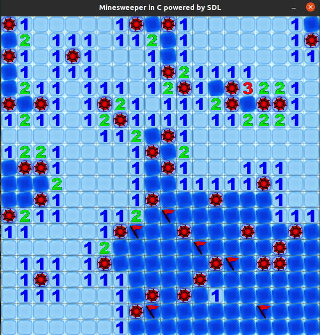

# Minesweeper SDL
Retake of the old Windows NT 3.1 version written in C powered by SDL2

Minesweeper for versions of Windows protects the first square revealed from Windows Vista onward, players may elect to replay a board, in which the game is played by revealing squares of the grid by clicking or otherwise indicating each square. If a square containing a mine is revealed, the player loses the game. If no mine is revealed, a digit is instead displayed in the square, indicating how many adjacent squares contain mines, if no mines are adjacent, the square becomes blank, and all adjacent squares will be recursively revealed. The player uses this information to deduce the contents of other squares and may either safely reveal each square or mark the square as containing a mine. 

# Installation

## Debian/Ubuntu
```bash
sudo apt install libsdl2-dev libsdl2-image-dev libsdl2-ttf-dev libsdl2-mixer-dev make gcc
```

## macOS
use Homebrew to install the missing packages
```bash
/bin/bash -c "$(curl -fsSL https://raw.githubusercontent.com/Homebrew/install/HEAD/install.sh)"
brew install sdl2 sdl2_image sdl2_mixer sdl2_ttf make gcc
```

# Compiling and running

```bash
cd src/  
make
./minesweeper
```